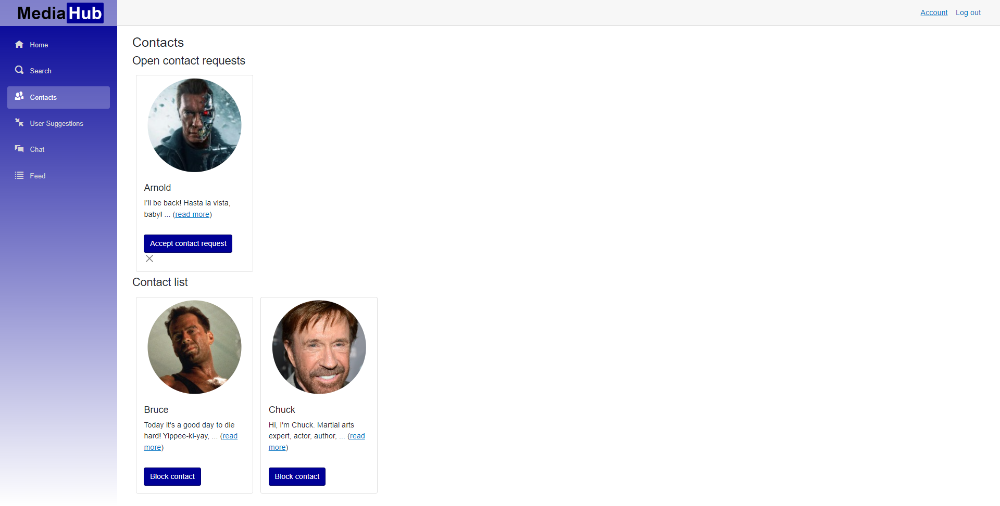

# MediaHub
A social media platform with a focus on the media interests of users.

This repository contains the [code](./MediaHub), the [documentation](./SEProj_MediaHub_Documentation.pdf) and the [final presentation](./SEProj_MediaHub_Presentation.pdf) of the software engineering project (SE Project) at OST - Eastern Switzerland University of Applied Sciences.

## Contribution information
- Contributors:
  - Adrian Locher
  - Benjamin Kern
  - Dominik Ehrle
  - Jason Benz
  - Marco Agostini
- School: [OST - Eastern Switzerland University of Applied Sciences](https://www.ost.ch/)
- Module: SE Project (SEProj)
- Semester: Spring 2022
- Advisor: Thomas Kälin
- Final grade: 5.6 / 6

## Management Summary
### The Problem
The problem we wanted to solve is the lack of a social media site that focus on the users media interests instead of the user per se. Facebook, Twitter, etc. connect users based on the social graph (who knows whom). This leads to very small bubbles and echo chambers the user lives in. The task at hand was therefore to create a social media site where users can go beyond their usual social range, meeting new people and exchange with others sharing the same interests in different media (e.g. movies, books, etc.).

### The Solution
The solution to this problem is a social media site that connects users solely based on their interest. Who is connected to whom does not matter; The only aspect that is considered when suggesting users to each other is their media preferences. Users cannot even search for other users to add. This is very much intentional, as there are other platforms for simply communicating with people one knows. The platform also provides all the surrounding features that are necessary for a media centric platform: A search to discover new media, the ability to like, rate and comment media, administration of ones contacts and new user suggestions as well as a chat to communicate.

### Evaluation
The solution is fitting to solve the problem. While the software could be greatly expanded (e.g. adding group chats, adding media news, supporting media other than movies, etc.) we achieved a solution that solves the problem to a sufficient degree.

### Final Product
#### Login / Registration Page


#### Home / User Profile Page


#### Search / Media Details Page


#### Contacts Page


#### User Suggestions Page


#### Chat Page


#### Feed Page


## Local Development
The application has container support and can be startet completely in a container environment. In order to use the containerized version in Visual Studio, the right solution must be choosen. In Rider, the application profile must be customized in order to start the containers.

The application can either be run as container or locally with only the database in a container.

### Containerized Development
The containerized development is best used under Visual Studio, since it does configure itself automatically. This way of working is not recommended and therefore not further described in the documentation.

### Normal Development 
The normal development mode does requrie the developer to start a dockerized Microsoft SQL Server in order to provide the application the needed backend to save the data. Please make sure your development environment has Docker installed.

To start the SQL Server container the first time the following command can be used. The container does also expose the SQL ports on the local machine. This enables the developer to connect to "localhost:1433" to administrate the SQL Server and it's databases. For this various tools can be used.

**Attention:** under Windows the single quots must be replaced with double quotes!

```
docker run -e 'ACCEPT_EULA=Y' -e 'SA_PASSWORD=SA1234567!s' -p 1433:1433 -d --name db mcr.microsoft.com/mssql/server:2019-latest
```

The container is persistent, therefore it does not get removed automatically even if your restart your machine. But the container has to be started newly if you reboot the machine. The first command displays alle containers on the machine. The last command is used to start a container.

```
docker ps --all
docker stop [CONTAINER ID]
docker start [CONTAINER ID]
```

## Automatic Deployment
Since the project was originally hosted on GitLab, corresponding pipeline files are still available. These were not deleted for completeness. The automatic deployment does not work on Github, but only on the original GitLab account. The GitLab project is not publicly available.

The application is automatically build and deployed to an Ubuntu Server 20.04.4 TLS. The server is only reachable from the faculty network or via the VPN client. The host is reachable via SSH with the corresponding private key. [Host FQDN](sifsv-80057.i.ost.ch), [Host IP](152.96.80.57). The deployment is automatically expose on the IP and the FQDN.

The deployment can only be triggered from the main branch and needs to be triggered manually. This enabled the development team to dynamically deploy a new version of the application to the test server.


### Deployment Script on Server

The deployment does trigger an SSH connection to the server where the server does update it's code from the main branch of the repository. Afterwards a new docker image is build and the old image/running container is destroyed. The database is persistent and does not get replaced in the process of a new deployment (The bash script lays under: ./server-deployment.sh).

**Attention:** The deployment does exchange the appsettings.json file for an adjusted version with another connection string to the database.